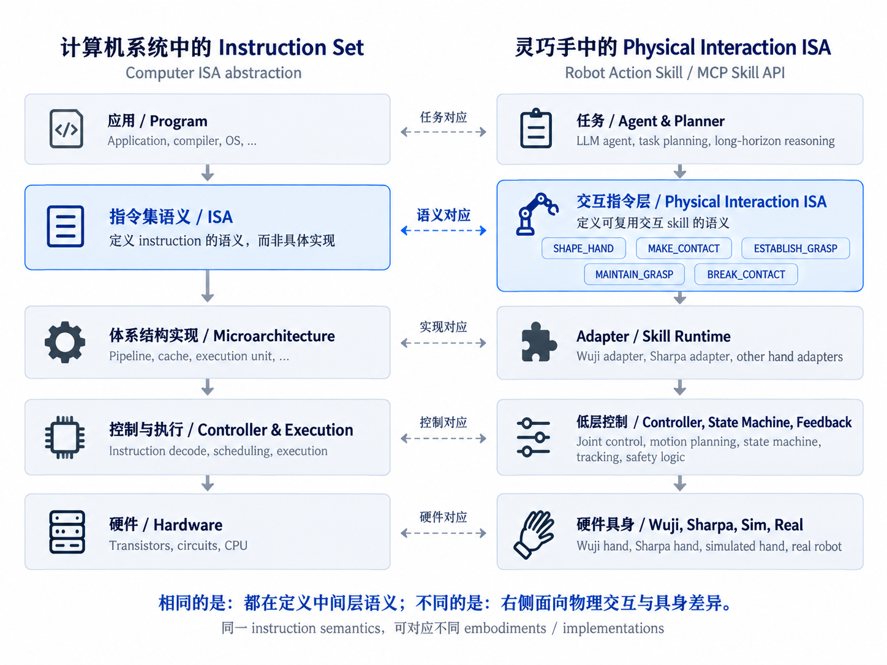

# DexISA_v2

DexISA is an offline MuJoCo reference runtime for semantic physical-interaction Skills across Wuji Hand2, Sharpa Wave, Allegro V5 4F, and Robotiq 2F-85. The Codex entrypoint is [.agents/skills/dexisa/SKILL.md](.agents/skills/dexisa/SKILL.md); executable Python lives in the installable `dex_hand` package. The Skill is not a substitute for installing the runtime.



## Architecture and migration — Phase 2

This repository contains the Phase 1 reorganization of DexISA from source commit `5429c8e`, followed by a focused Phase 2 repair based on `f830b3d`. It has a fresh publication history; the original repository was accessed read-only. The runtime package remains `dex_hand`; existing controller/physics/evaluation thresholds and the frozen records below are retained.

| Path | Purpose |
| --- | --- |
| [spec/](spec/README.md) | Implemented MAKE_CONTACT contract and broader historical draft references |
| dex_hand/core/, skills/, modes/, runtime/ | Shared types and existing reference execution; request resolution/session dispatch |
| dex_hand/session_factory.py + core/scene.py | Bootstrap chooses the concrete Adapter and ScenePlan, then injects RuntimeSession |
| dex_hand/adapters/ | Four hand realizations and shared primitives; models/meshes stay external |
| dex_hand/bridge/ | Thin JSONL transport and CLI |
| [evaluation/](evaluation/README.md) | A-D tasks, external evaluators, Agent surfaces, shared shield, runners and metrics |
| pilot/ and dex_hand/evaluators/ | Compatibility imports for existing callers |
| [docs/experiments/](docs/experiments/) | Original frozen historical records at unchanged paths |

Read [ARCHITECTURE.md](ARCHITECTURE.md), [audit](ARCHITECTURE_AUDIT.md), [parameter classification](PARAMETER_CLASSIFICATION.md), [plan](REFACTOR_PLAN.md) and [migration results](REFACTOR_RESULTS.md), and [Phase 2 results](PHASE2_RESULTS.md).

MAKE_CONTACT exposes object/group operands and `contact_present` or `contact_dwell` termination through the existing controller; generic Agent-visible constraints are intentionally deferred; see [implemented request format](docs/MAKE_CONTACT_INTERFACE.md). The bare legacy call remains compatible. Runtime receives an injected Adapter and ScenePlan and contains no concrete hand binding. Other instructions are not broadly parameterized in this phase. Evaluation is an optional consumer, not a runtime dependency.

## Native model experiment progress: POINT in MuJoCo (2026-09-28)

**Frozen progress snapshot: 2026-09-28T07:02:43+00:00; 781/800 completed native model episodes.** The model is `gpt-5.6-luna` with `low` reasoning and no fallback. Each episode uses an independent Agent context. The benchmark executes outside this ISA repository; this update publishes results and does not alter runtime or Skill behavior.

### All completed episodes

| Embodiment / interface | Completed / planned | Success | Failure | Native total tokens | Cumulative wall time (s) |
| --- | ---: | ---: | ---: | ---: | ---: |
| wuji / SKILL_AGENT | 100/100 | 100 | 0 | 2,643,049 | 1333.657 |
| wuji / DIRECT_AGENT | 100/100 | 44 | 56 | 3,707,185 | 4130.281 |
| sharpa / SKILL_AGENT | 100/100 | 82 | 18 | 2,739,107 | 1422.023 |
| sharpa / DIRECT_AGENT | 100/100 | 59 | 41 | 4,752,620 | 4077.718 |
| allegro_v5 / SKILL_AGENT | 100/100 | 15 | 85 | 3,169,279 | 2387.942 |
| allegro_v5 / DIRECT_AGENT | 81/100 | 17 | 64 | 3,350,394 | 4279.617 |
| robotiq_2f85 / SKILL_AGENT | 100/100 | 4 | 96 | 1,082,520 | 1603.677 |
| robotiq_2f85 / DIRECT_AGENT | 100/100 | 4 | 96 | 2,321,787 | 2956.921 |

Totals include failures. Wall time is the sum of episode durations, not elapsed time of the parallel batch. An incomplete condition is a progress snapshot, not a final success rate.

### Average cost of all successful episodes

Each interface independently includes every successful measured episode with valid native token audits. No seed matching or equal-count subsampling; failed and unfinished episodes excluded from success-only means.

| Embodiment / interface | Successful samples | Mean native tokens | Mean wall time (s) | Mean Agent-active (s) | Mean simulation (s) |
| --- | ---: | ---: | ---: | ---: | ---: |
| wuji / SKILL_AGENT | 100 | 26,430.5 | 13.337 | 13.318 | 0.287 |
| wuji / DIRECT_AGENT | 44 | 37,458.9 | 41.887 | 41.803 | 1.587 |
| sharpa / SKILL_AGENT | 82 | 26,449.6 | 13.525 | 13.508 | 0.242 |
| sharpa / DIRECT_AGENT | 59 | 42,214.9 | 34.270 | 34.124 | 2.209 |
| allegro_v5 / SKILL_AGENT | 15 | 25,247.9 | 15.346 | 15.321 | 0.356 |
| allegro_v5 / DIRECT_AGENT | 17 | 23,950.2 | 32.907 | 32.858 | 0.878 |
| robotiq_2f85 / SKILL_AGENT | 4 | 8,073.2 | 7.213 | 7.201 | 0.193 |
| robotiq_2f85 / DIRECT_AGENT | 4 | 9,469.5 | 10.864 | 10.846 | 0.441 |

These success-only averages use each interface's own successful cases, so the case sets and counts can differ. They exclude failure cost and do not estimate overall efficiency.

### Tasks and experimental settings

| Item | Setting / physical goal | Qualification / execution |
| --- | --- | --- |
| Model | GPT-5.6 Luna; reasoning `low`; no model fallback; independent Agent context per episode | Actual native model calls |
| Platforms and physics | Wuji Hand2, Sharpa Wave, Allegro V5 4F and Robotiq 2F-85; fixed palm; offline MuJoCo; 2 ms timestep, implicitfast, gravity −9.81 m/s², 80 solver iterations | No physical hardware, moving wrist or robot arm |
| A — POINT | Empty physical target scene; index fingertip to a world point with ≤2 mm error continuously for 100 ms; 3 s simulation budget | Wuji/Sharpa A baseline plus the nominally qualified Allegro/Robotiq A fixtures below; randomized-goal reachability is a separate limitation |
| B — TOUCH | Supported cylinder; index contact in target region for 100 ms; object translation ≤2 mm; continued inward travel after contact ≤0.5 mm; 8 s budget | Wuji/Sharpa bindings unqualified; Allegro/Robotiq not assessed for this task; no model episodes |
| C — PRESS | Activate spring button at ≥8 mm displacement, then actual retreat ≥2 mm and geometrically no contact for 100 ms; 22 s budget | Wuji/Sharpa bindings unqualified; Allegro/Robotiq not assessed for this task; no model episodes |
| D — SLIDE | Start in index contact on fixed plane; slide to endpoint 20 mm away, error ≤2 mm for 100 ms; retain contact while moving; 10 s budget | Wuji/Sharpa bindings unqualified; Allegro/Robotiq not assessed for this task; no model episodes |
| E — ADD_CONTACT | Preserve thumb contact; add index target contact for 100 ms; whole-episode translation <2 mm, rotation <3°; 8 s budget | Wuji/Sharpa bindings unqualified; Allegro/Robotiq not assessed for this task; no model episodes |
| F — STABILIZE | Initial supported dual contact; independent physical stability for 0.5 s; no external disturbance; 5.5 s budget | Wuji/Sharpa bindings unqualified; Allegro/Robotiq not assessed for this task; no model episodes |
| G — RELEASE | Initial supported stable grasp; remove all geometric hand–object contacts, actual retreat ≥2 mm, supported and clear for 100 ms; 5 s budget | Wuji/Sharpa bindings unqualified; Allegro/Robotiq not assessed for this task; no model episodes |
| H — GRASP_FORMATION | From no contact, establish thumb/index contacts in specified regions and physical stability for 0.5 s; no lift or mandatory POINT/Skill stage order; 16.5 s budget | Wuji/Sharpa bindings unqualified; Allegro/Robotiq not assessed for this task; no model episodes |
| I — RELEASE_REGRASP | Initial stable region set A; physically controlled release, then region set B stable for 0.5 s; 22 s budget | Wuji/Sharpa bindings unqualified; Allegro/Robotiq not assessed for this task; no model episodes |
| J — ROTATE | Supported stable cylinder; signed ±30° about initial palm +Z; full orientation error <5°, translation <5 mm, final stability for 0.5 s; 10 s budget | Wuji/Sharpa bindings unqualified; Allegro/Robotiq not assessed for this task; no model episodes |
| Sampling and pairing | 100 requested seeds / hand (0–99); shared seeded initial checkpoint, physics model, goal, observations and evaluator for both interfaces; invalid resets are recorded without resampling | A budget: 4 hands ×100 seeds ×2 interfaces = 800 episodes |
| Reset distribution | Object/virtual-frame XY ±10 mm, Z ±3 mm, roll/pitch/yaw ±5°; friction 0.6–1.0, mass 0.8–1.2×, joint noise ±0.01 rad; fixture-specific exceptions apply | A has no physical object/support; friction and mass draws are not physical A parameters |
| Action interfaces | Skill: existing SHAPE_HAND POINT semantics realized by external benchmark IK + source-model position servo. Direct: named joint targets; no IK or semantic controller | Both observe fingertip position and local Jacobian; no required intermediate posture or Skill call order |
| Common safety | No forbidden self/environment contact; source joint/actuator limits retained; contact-group normal load cap 4 N (C: 3 N); benchmark penetration cap 1 mm; saturation >0.2 s abort; simulator faults abort | Evaluated each physical step; whole-episode violations prevent success |
| Timing and token accounting | Wall: episode thread/start to native turn completion. Agent-active: wall minus robot-tool handling (includes final model response). Simulation: MuJoCo time. Tokens: native response usage summed and audited against thread usage | Runtime initialization and full desktop startup are not included in wall time |
| Qualification denominator | Original Wuji/Sharpa A–J plan: 4,000 requests; 3,600 B–J unqualified. Added Allegro/Robotiq scope: A only, 400 requests | Unqualified bindings are not Agent failures |

### Additional-hand interpretation

- Allegro and Robotiq use deterministic, fixed palm mounts registered before scoring to the unchanged nominal world goal. Both interfaces share the same resolved model and reset checkpoint for each seed; mount configuration is included in the published JSON.
- Robotiq has one active degree of freedom and coupled planar jaws. **80/100 randomized A goals lie more than 2 mm outside its fixed jaw-tip plane and are physically unreachable.** Those seeds were retained under the original task rule. Its failures therefore mix embodiment workspace limits with controller/Agent performance; nominal qualification and reset safety do not establish reachability for every seed.
- Allegro Skill uses the frozen external POINT IK and source servo binding for this snapshot. The earlier local Allegro ramp-controller batch used a different fixed mount/controller and is not merged into these tables.
- Most recorded failures are `GOAL_NOT_REACHED_WITHIN_BUDGET`; source actuator-limit failures are separately listed in the failure CSV and JSON.
- Four attempts interrupted by the desktop restart were preserved locally. Completed responses consumed at least 33,483 additional tokens; terminal token accounting and complete wall times were unavailable. These costs are separate from the completed-episode totals.

This is an A-only simulation comparison, not a completed A–J benchmark or real-hardware result. Skill-side POINT control is an external experimental realization of existing SHAPE_HAND semantics, not a claim that the published Codex Skill executes A–J unchanged.

Public data: [snapshot JSON](docs/experiments/2026-09-28-point-progress.json), [all-episode totals CSV](docs/experiments/2026-09-28-point-progress-all.csv), [all-success mean costs CSV](docs/experiments/2026-09-28-point-progress-successful.csv), [per-episode metrics CSV](docs/experiments/2026-09-28-point-progress-episodes.csv), [failure reasons CSV](docs/experiments/2026-09-28-point-progress-failures.csv), and [experiment report](docs/experiments/2026-09-28-point-progress.md). GitHub shows a frozen snapshot and does not automatically follow the ongoing local batch.

## Install and run

Cloning or downloading this repository gives you the **Skill instructions and runtime source**, but is not by itself enough to run a hand. You need a working Python 3.11 or newer interpreter (use an existing installation if available), Python dependencies, and the selected hand's separately obtained model and meshes. Open the cloned repository as the Codex workspace so Codex can discover its project Skill at `.agents/skills/dexisa/SKILL.md`; no separate global Skill copy is needed when working inside this repository. The Skill tells Codex how to use the bridge; it does not install or launch the runtime automatically.

On a new Windows machine, for example:

```powershell
git clone https://github.com/Harbara-Ai/DexISA_v2.git
cd DexISA_v2
python --version  # Confirm this is Python 3.11 or newer; install Python only if needed.
python -m venv .venv
.\.venv\Scripts\Activate.ps1
python -m pip install -e .

# Obtain the selected hand's model and meshes separately (docs/ASSETS.md).
$env:SHARPA_MJCF = 'C:\models\sharpa_wave\right_sharpa_wave.xml'
dexisa-mujoco --hand sharpa
```

The bridge prints a `READY` JSON line when the selected scene loads. In Codex, open this `DexISA_v2` folder and explicitly ask it to use `$dexisa` with one selected hand in offline MuJoCo. For Wuji, Allegro, or Robotiq, set the corresponding model path instead; Allegro and Robotiq also require the local model-generation step in [docs/ASSETS.md](docs/ASSETS.md). A GitHub ZIP works as source too.

The equivalent platform-neutral runtime commands are:

```sh
python -m pip install -e .
dexisa-mujoco --hand wuji
# Or: python -m dex_hand.bridge.mujoco_adapter --hand wuji
```

Select exactly one of `wuji`, `sharpa`, `allegro_v5`, or `robotiq_2f85`. The bridge is a persistent JSON-lines process: read its `READY` response, then send one JSON object per input line. For example, `{"tool":"describe_capabilities"}` and `{"tool":"get_state"}`. Other dispatchable operations are `SHAPE_HAND`, `MAKE_CONTACT`, `ESTABLISH_GRASP`, `MAINTAIN_GRASP`, and `BREAK_CONTACT`. The current bridge uses one supported-object scene per hand. MAKE_CONTACT accepts the object/group/termination request described in [docs/MAKE_CONTACT_INTERFACE.md](docs/MAKE_CONTACT_INTERFACE.md); arbitrary objects or new target regions are not supported.

**Models and meshes are external.** Before starting a hand, configure its model path as described in [docs/ASSETS.md](docs/ASSETS.md). The four environment variables are `WUJI_MJCF`, `SHARPA_MJCF`, `ALLEGRO_V5_MJCF`, and `ROBOTIQ_2F85_MJCF`. Missing model, URDF, or mesh files produce explicit startup errors. The repository does not auto-download vendor assets.

The installed CLI runs offline MuJoCo. Optional real-adapter source is published in [wuji_real.py](dex_hand/adapters/wuji_real.py) (legacy transport/profile backend) and [wuji2_real.py](dex_hand/adapters/wuji2_real.py) (shared-driver pilot); both expose `WujiRealAdapter`. The pilot module retains `Wuji2RealAdapter` as a compatibility alias. Real use requires the caller-supplied external driver or legacy engineering modules, SDK transport and profiles; these dependencies are documented in the modules. Importing either module does not connect to or move hardware. A successful simulated Skill outcome does not establish free-space force closure or real-hardware safety. Reproducible simulation requires the versions and source files listed in the asset guide.

## Repository contents

- `dex_hand/adapters/`: four MuJoCo Adapters and shared simulation mechanics.
- `dex_hand/core/`, `skills/`, `modes/`, `sim/`: shared ISA types, observations, controllers, and scene composition.
- `dex_hand/bridge/mujoco_adapter.py`: installable JSONL bridge and CLI.
- `.agents/skills/dexisa/`: Codex usage instructions and UI metadata.
- `scripts/build_official_mujoco.py`: local Allegro/Robotiq base-XML generator from separately obtained pinned source assets.
- `dex_hand/schema/`: packaged v0.2 result schema source.

The A–D task definitions and Agent runner now live in `evaluation/`, with `pilot/` compatibility entry points; their preliminary result artifacts are not distributed in the current branch. The separate POINT progress snapshot above is unchanged.

The DexISA code in this public repository has no top-level redistribution license declared yet. Public visibility does not itself grant permission to redistribute or modify the code; the owner should choose a code license before inviting downstream reuse. Vendor hand models and meshes remain external under their own license terms.

## Offline verification

With the external assets configured and the declared dependencies available:

```sh
python -m unittest discover -s tests -v
python scripts/extract_instruction_schemas.py --check
```

The four-hand request test requires all four external models. An unpublished historical cross-hand checksum check explicitly skips when its artifact is absent; this does not count as historical proof. See PHASE2_RESULTS.md for the current before/after results and Evaluation preservation evidence. These tests make no LLM calls or hardware connections.

## Wuji2 real-hardware pilot: V sign (2026-10-01)

One fresh Agent per interface made a V sign (比耶) on the same real Wuji2 right hand, using **gpt-6.1-sol / xhigh**, no model fallback, and the same low-level SDK driver. DexISA exposed generic finger-shaping operands; Direct exposed native joint targets. Neither Agent received a V-sign target or prior Agent history. The operator judged both physical gestures **successful**; there was no automatic gesture evaluator. The Adapter source used for this pilot is now published in [wuji2_real.py](dex_hand/adapters/wuji2_real.py); its shared Wuji driver and engineering assets remain external.

**Starting poses differed:** after a reset did not meet its existing settling criterion, the operator accepted the current pose for Direct. The measured initial joint states differ by up to **0.1072768 rad**. This is one measured episode per interface with different starting poses; it does not establish comparative performance.

Tokens are authoritative native usage, cross-checked between `thread/tokenUsage/updated` and the sum of `rawResponse/completed` events; both audits passed. Cached input is part of input, and reasoning is part of output. Episode wall time excludes setup, preceding resets, and operator-confirmation waits. Inference and robot-tool handling are components of episode wall time. Motion-command intervals measure driver execution, not visually measured physical movement. Direct's preceding **60.005 s** reset attempt is recorded separately and excluded from the episode table.

Both episodes retained a `VELOCITY_LIMIT` error after the SDK disable request. The operator judgement records successful hand shapes separately from these runtime errors.

In these two episodes, Direct used 11,731 more total tokens (+26.8%) and 29.526 s more episode wall time (+54.1%).

Public data: [experiment report](docs/experiments/2026-10-01-wuji2-v-sign-real-pilot.md) and [aggregate metrics JSON](docs/experiments/2026-10-01-wuji2-v-sign-real-pilot.json).

| Metric | DexISA | Direct |
| --- | ---: | ---: |
| Human gesture judgement | Success | Success |
| Measured episodes | 1 | 1 |
| Native total tokens | 43,797 | 55,528 |
| Input tokens | 42,766 | 53,926 |
| Cached input tokens (included in input) | 23,168 | 27,648 |
| Non-cached input tokens | 19,598 | 26,278 |
| Output tokens | 1,031 | 1,602 |
| Reasoning tokens (included in output) | 810 | 1,117 |
| Episode wall time (s) | 54.540 | 84.066 |
| Native inference time (s) | 48.326 | 77.799 |
| Motion-command intervals (s) | 4.009 | 4.516 |
| Shaping / joint-tool time (s) | 4.126 | 4.609 |
| Enabled interval (s) | 9.513 | 27.912 |
| Tool calls | 4 | 5 |
| Explicit state-query calls | 1 | 1 |
| Native inference responses | 4 | 5 |
| Motion calls | 1 `SHAPE_HAND` | 2 `set_joint_targets` |
